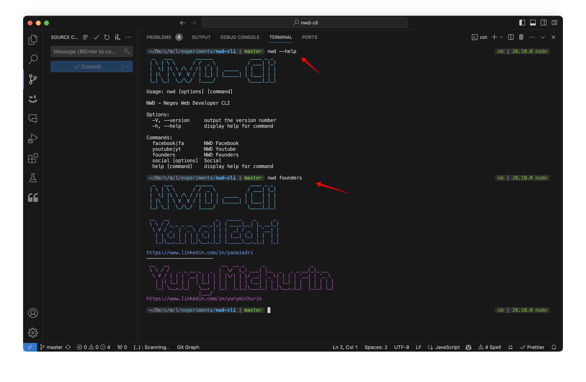

# NWD CLI
This is a CLI for Negev Web Developer group - Just a play for fun project :)

You can see the facebook, youtube and founder details
- facebook: https://www.facebook.com/groups/145321082797079
- youtube: https://www.youtube.com/@negevDev

## How to run
1. clone
2. npm install (Node V20)
3. run `npm run global` or `npm run link` 
4. run commands such:
`nwd --help`
`nwd --version`
`nwd founders`
`nwd social --help`
`nwd social --fa`
`nwd social --yt`
`nwd facebook`
`nwd youtube`

